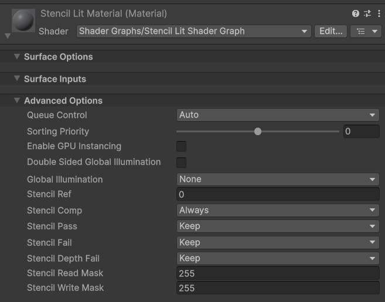
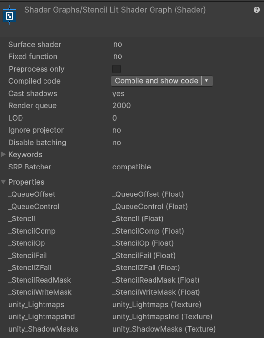
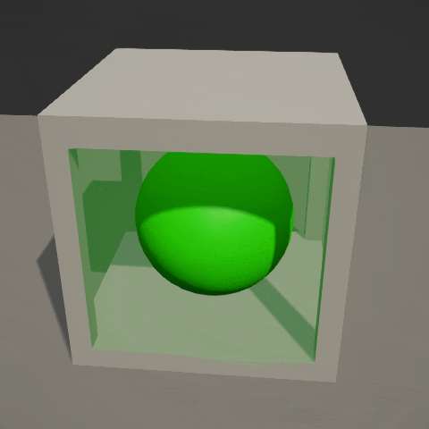
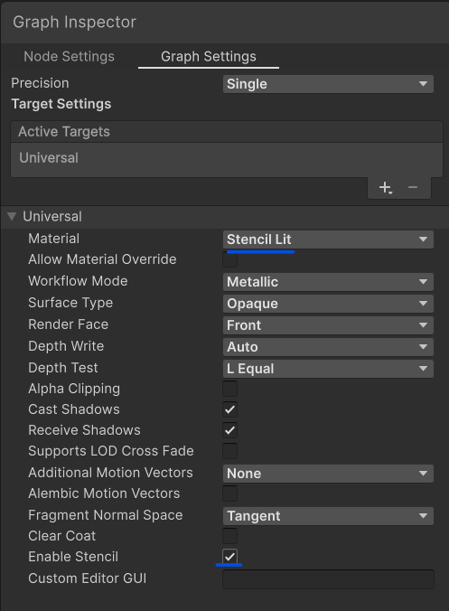

## Unity URP Stencil ShaderGraph Targets
This package adds **Stencil Lit** and **Stencil Unlit** material SubTargets to the Universal Shader Graph target for URP.
They are based on Unity's built-in Lit and Unlit subtargets and add Canvas-style stencil properties and stencil render state support.




## Dependencies
* Works on Unity version 2021.2 or higher, with URP version 12 or higher

## Installation

### Option 1 (Package Manager via Git URL)

1. Open `Window > Package Manager`.
2. Click `+`.
3. Select `Add package from git URL...`.
4. Use:

```text
https://github.com/dgul3d/com.gulievstudio.universal-stencil-lit-shadergraph-target.git?path=/Packages/com.gulievstudio.universal-stencil-lit-shadergraph-target
```

### Option 2 (Local package)

1. Download this repository.
2. Copy `Packages/com.gulievstudio.universal-stencil-lit-shadergraph-target` into your project (for example under a local packages folder).
3. Add it as a local package through Package Manager.

## Demo



Samples folder contains a demo scene with a basic "impossible geometry" setup with four portal materials and four object materials. Rendering order is managed by Render Queue in the material settings.

## How to use
Create a new graph from:

- `Assets/Create/Shader Graph/URP/Stencil Lit Shader Graph`
- `Assets/Create/Shader Graph/URP/Stencil Unlit Shader Graph`

Then select the **Stencil Lit** or **Stencil Unlit** subtarget in the graph inspector. 
Enable stencil in the graph inspector with the **Enable Stencil** toggle.


